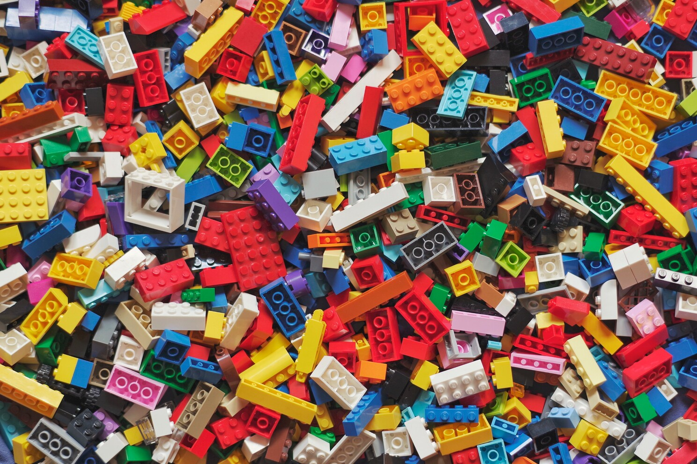
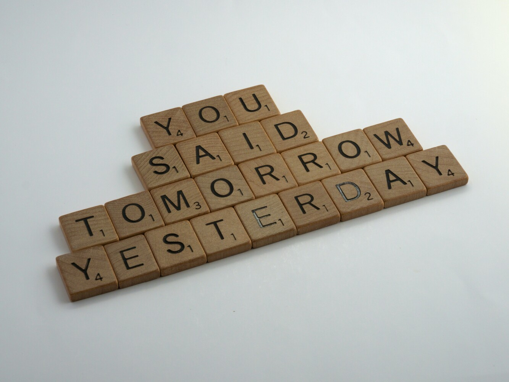
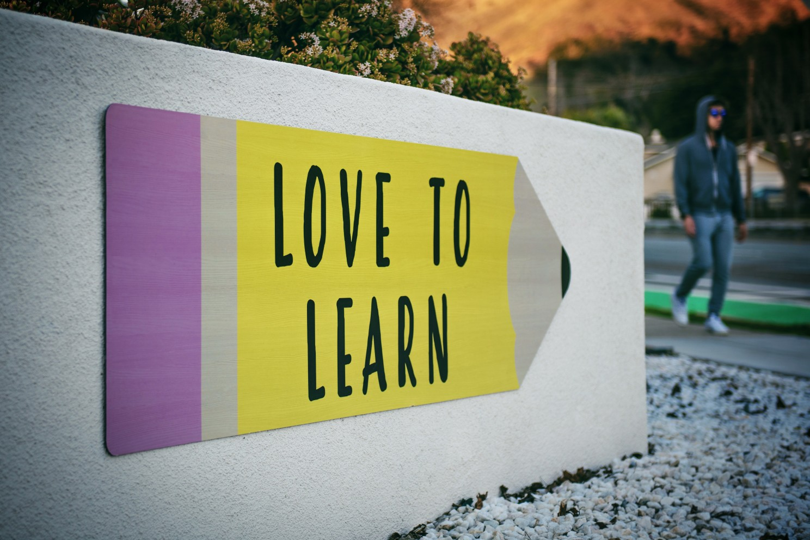
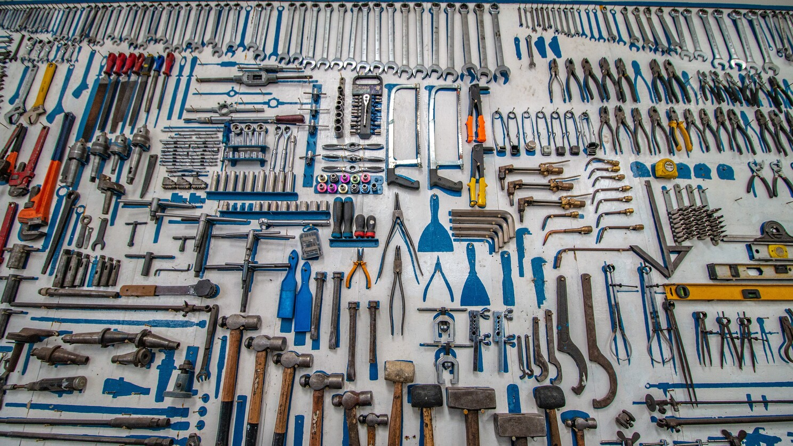

*Opinions are my own and not the views of my employer.*

## What is productivity?

*Photo by [Xavi Cabrera](https://unsplash.com/@xavi_cabrera) on [Unsplash](https://unsplash.com/)*

I have always been interested in the topic of productivity since I was in the Engineering side. But I remember that, at that time, I considered the challenge of how to **measure my productivity** something almost given for free. I was easily able to check how many deliveries I was doing on any given day, how many features I was developing, how many bugs I was fixing, etc. 

Is when I moved my first steps into Leadership that things started getting more complicated. As a leader, most of the time you put some seed down today, just to let things grow and (hopefully) see the impact sometime in the future.

At that time I was going back home with **many doubts** about how productive I have been on that day, wondering if I was fulfilling what was expected from me. Have I done the right job? That's what triggered my research, my experimentation, and ultimately, my conclusions that I am ready to share with you in the hope of inspiring people with similar experiences.

Let's start with a simple concept. **What is productivity?** I'm not here to give you the Best&One definition of it. There are many, many out there you can find thanks to your friend who is Google.

Then what is productivity from "my" perspective? Let's use an analogy. So let's say that you want to build a Lego model, right? You want to build your Star Wars starship with your Legos.

But unless it's very small, it's very unlikely you will complete it in one single day. You need to work on it day by day, brick after brick, to go in the direction of your goal so that you can ultimately finish your starship. So, to me, productivity is **the sense of accomplishment you get when you are realising that you're building your goal on your daily routine**.

There is a caveat to this approach, a bit of a challenge: you might end up adding bricks every day and then feeling you're actually achieving or accomplishing something. But you could be starting a new Lego model every day. This is something you need to be aware of. Because even if you are doing stuff, it doesn't necessarily mean that you're doing the most important things that will help you to drive toward your final goal. So be aware of how many lego models you want to build, and limit them to the bare minimum. I will expand later on this point.

## The role of procrastination

*Photo by [Brett Jordan](https://unsplash.com/@brett_jordan) on [Unsplash](https://unsplash.com/)*

You cannot talk about productivity without mentioning the role of procrastination. Procrastination is something that is a part of the human being. Let's be clear: **everyone procrastinates**. Everyone, even the most productive person in the world. Every productivity hero, guru, etc., everybody does procrastinate.

And to some extent, procrastination is not even bad. It's a defense mechanism humans have in order to release stress and rebalance their level of energy. And it happens.

As long as procrastination is the **deliberate choice** to have some distraction: have your coffee or post on social media, for example, then it is something that may actually help your productivity. The problem is when you don't even realize you are procrastinating. When at the end of the day you look back and realize that you haven't put any focus on building your Starship.

Awareness and being deliberate are the two concepts that I would like you to keep in your mind while I expand on how we could work toward reducing our procrastination levels and improve, as a consequence our productivity.

## Mindfulness & Meditation

*Photo by [Dingzeyu Li](https://unsplash.com/@dingzeyuli) on [Unsplash](https://unsplash.com/)*

A short story. My wife is Buddhist, so to know her better (well was my girlfriend when I realized it, lol), I read a few books about it (one of them was "The Reluctant Buddhist" by William Wollard). I'm still not Buddhist, but I got caught about its philosophy, which includes **Mindfulness & Meditation** as part of the practices.

Years later, while reading "The productivity project" by Chris Bailey, I was positively surprised that the author himself was Buddhist. A whole chapter in the book is about using Mindfulness & Meditation as a tool for improving productivity. So I decided to give it a go. Let's clarify, I am not an expert on the subject, I just want to share with you my own experience. If you want to know more about the difference between the two, I recommend you to read [this article by Joshua Schultz](https://positivepsychology.com/differences-between-mindfulness-meditation/#:~:text=Mindfulness%20is%20a%20quality%3B%20meditation%20is%20a%20practice&text=While%20there%20are%20many%20definitions,develop%20different%20qualities%2C%20including%20mindfulness), Psy.D.

Meditation for me is something as simple as closing your eyes, disconnecting from the world around you, and trying to think about nothing but just focusing on your breath. It may sound simple, but your brain is an always-ON engine that keeps processing information. The challenge is to realize that your focus is lost and then gently come back to your breath. That's it. This is as easy as going to the gym for the first time: you need to practice to get better.

But how this is related to productivity? In my own experience, it did help me with **prioritization**. I have been able to see more clearly what is the Lego model I wanted to build. It also helped me to manage the sense of overwhelming that I was feeling in certain particularly busy moments of my life when I realize that there is more to do than time for doing it. That practice helped me to rebalance the energy and to realign to what actually is very important. Ultimately, I experienced an **increased level of focus**. Our brain is like a muscle, and Meditation is just an exercise you do to keep it healthy and perform better.

## The rule of three

*Photo by [Gabriel Meinert](https://unsplash.com/@gabrielmeinert) on [Unsplash](https://unsplash.com/)*

While Meditations help to see things more clearly, you still have to actively limit your work in progress. Among various approaches I have tried, the one that I found most effective is called the **Rule of Three**. You basically focus on the top three most important goals, your three Lego models. You can apply it recursively to break the work into smaller chunks. For example, you could decide the priority for the year, then for the month, ..., up to any given day. The important thing is to make sure that, whatever smaller step you are making, it is contributing towards your bigger picture.

Overall I observed that this approach helped me to 

1.  keep the focus;
    
2.  reduce my level of procrastination;
    
3.  ultimately achieve more.
    

You may wonder why this approach contributes to reducing procrastination. What I observed is that procrastination increases when you are on tasks that are very boring or very hard (e.g., fill your taxes). Smaller tasks give a quick feedback loop (e.g., open the tax model and fill in one line), and look much more achievable, so you naturally are less inclined to postpone it. There are only two things that fight against you in applying this kind of process or habit: **you and yourself**. Your day is busy, and you are stretched in many many directions. I am not here to say: okay, it's super easy; but when you start seeing the first results you may want to apply it more and more.

You have now set your priority, but stakeholders are challenging you and you need to defend it. Defending your priorities does not simply mean **saying NO**. 

In order to be able to defend your priority you need:

1.  **Alignment**. Is the Lego model you are building a priority for your organization as well?
    
2.  **Pragmatism**. Is there a need to pivot and change strategy? 
    

Do you need to refocus because of an unpredictable production incident? Remember that ultimately you want to be deliberate on your choices, even if the decision is to temporarily park your priorities.

The first time I heard about **Focus Time** was while using tools like Clockwise or Calendly, which basically help you to manage your calendar so that you can find slots of time that are free of noise so that you can finally focus on "doing" work.

But there is a warning, the so-called **Parkinson's law**: "the work expands to the time that you allocate for its completion". So if you allocate a 3 hours slot to write a document, for example, it is likely you will use all of it. But if you set a 1-hour slot instead, it is very possible you finish 80% of the work in that time. If you think about it, you may have more time than you expect in your busy calendar.

## Learning is productivity

*Photo by [Tim Mossholder](https://unsplash.com/@timmossholder) on [Unsplash](https://unsplash.com/)*

Let's now do a quick game. Take 30 seconds and try to think of your top three priorities..............done? Now tell me; is **Learning** any of them? If the answer is no, it's unlikely you ever have time for it. But keep learning and keep improving is deeply bound to your **productivity**! 

Learning can be many things. Sometimes we think we are not learning when actually we are. It could be passive, like reading books, attending meetups, or listening to a Podcast for example; but it could also be active when you put to practice new skills.

In some cases, you may not even be aware of the fact you are learning. Any situation at work that you might face for the first time can be a trigger. For example, imagine you are leading a team and suddenly there is a reorganization that causes the team to be split. You could perceive this as a negative event (I know your feeling) but actually, it's an opportunity! How do you face this difficult situation? How do you emotionally react? How do you retrospect and avoid this to happen again or mitigate it better?

## Productivity tools

*Photo by [Cesar Carlevarino Aragon](https://unsplash.com/@carlevarino) on [Unsplash](https://unsplash.com/)*

Now you know some techniques that may be handy for you to improve your productivity. But how about actual **productivity tools**? There are plenty out there and I tried a few of them: tools that aim to let you create the best to-do list ever; tools that generate a certain background noise (like the one in a cafeteria for example) that, based on studies, aim to increase your ability to focus; I even heard of a special helmet that you can put on yourself to measure the amount of focus you have during the day. 

Experimenting with new tools for productivity is good but there are some **drawbacks** from my perspective. First of all, trying tooling is fun and this easily becomes a source of procrastination. It's almost always more satisfying to try a new tool rather than just stick with what you have and focus on what is important.

On top of that there is potentially another trap: in most cases, these tools require you to be online so you cannot make a conscious choice to disconnect from WiFi and get the best of uninterrupted focus time. The logic is simple: whoever builds the tool wants you to use it. But because of this, the tool itself becomes a source of distraction (direct or indirect). In my personal experience, the best tool I ever used is **paper and pencil**. I never found anything that works better than that.

## The recipe

*Photo by [Rinck Content Studio](https://unsplash.com/@rinckad) on [Unsplash](https://unsplash.com/)*

Grab your pen! I am finally ready to reveal my recipe for the **Productivity Cocktail**. Take a glass and pour in equal parts: focus management, time management, and energy management. 

1.  **Focus**, in order to be able to know what is important for you and be able to keep up with the direction of your travel. 
    
2.  **Time**, to cultivate a better awareness of the time you have (and you may think you don't), and how you can maximize it.
    
3.  **Energy**, to know how your energy level changes during the day, weeks, months, etc so you can optimize for it and not feel guilty due to the fluctuations of your productivity.
    

## Credits & References

- [The Productivity Project](https://alifeofproductivity.com/the-productivity-project/) by Chris Bailey
- [Stop Thinking and Start Doing: The Power of Practicing More](https://jamesclear.com/learning-vs-practicing#:~:text=Practice%20Is%20Learning%2C%20But%20Learning%20Is%20Not%20Practice&text=Active%20practice%2C%20meanwhile%2C%20is%20one,meaningful%20contribution%20with%20your%20knowledge.) by James Clear
- [Slack: Getting Past Burnout, Busywork, and the Myth of Total Efficiency](https://www.goodreads.com/en/book/show/123715.Slack) by Tom DeMarco