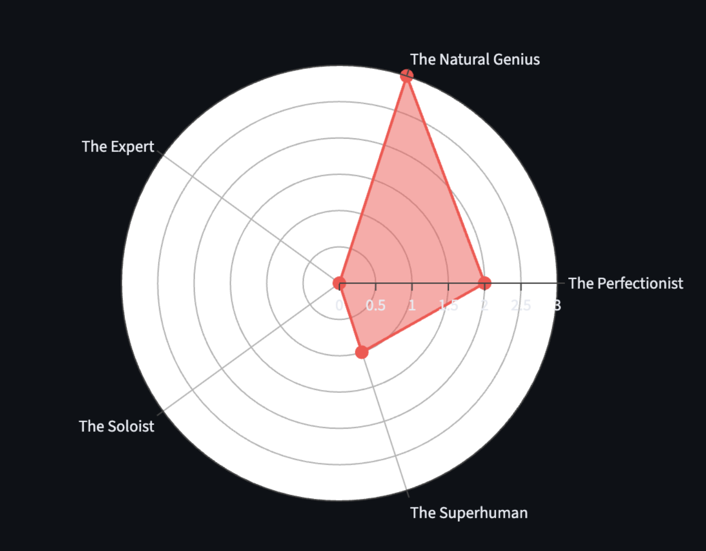

## The Voice in My Head

"Who are you to tell them anything?" "You're just lucky they haven't figured you out yet."

As an Engineering Director, I manage complex systems, scale platforms, and lead talented managers. Yet, for years, these sentences have been the background noise of my career. For a long time, I thought this was a "bug" in my personality, something to fix, hide, or delete.

Today, I'm launching my journey into **Scientific Leadership** by tackling the hardest topic first: **The Impostor Syndrome**. Because, as it turns out, the science says I was wrong. It's not a bug. It's a feature.

## The Origin: It's Not Just "In Your Head"

The term "Impostor Phenomenon" dates back to 1978, when psychologists **Pauline Clance** and **Suzanne Imes** studied high-achieving women. They identified that pervasive feeling that successes are merely the result of "luck" or "deceiving the system."

But it was **Dr. Valerie Young** who gave us the map. She identified 5 archetypes of "Impostors":

1. **The Perfectionist:** One minor flaw ruins the entire achievement.
2. **The Natural Genius:** If it's not easy or immediate, it's a failure.
3. **The Expert:** Never feels prepared enough, regardless of certifications.
4. **The Soloist:** Asking for help is a sign of weakness.
5. **The Superhuman:** Must excel in every single role (parent, leader, friend) to feel "enough."

## Engineering the Solution: Measuring the Doubt

As an engineer, I don't like vague feelings. I like metrics. To understand my own "Impostor profile," I used **Gemini, GitHub,** and **Streamlit** to build a Web App that visualise the score for each of these archetypes.

<small>My personal weight against the impostor archetypes.</small>

My results were eye-opening. Seeing the data didn't make the feeling go away, but it made it _manageable_. It transformed an emotional storm into a data point.

## Is confidence key to success?

We are taught that confidence is the key to success. But **Adam Grant** and researcher **Basima Tewfik** (MIT) have flipped the script.

Their research suggests that "Impostors" actually have a competitive advantage:

- **They work harder:** Because they fear being "found out," their preparation is meticulous.
- **They work smarter:** They don't take their assumptions for granted.
- **They become better learners:** This is the core of **Scientific Leadership**. Because they don't assume to know everything, they are more open to new data, new feedback, and continuous growth.

## Inviting the Impostor to the Meeting

I've stopped trying to silence that voice. Instead, I've started inviting my "Impostor" to my leadership meetings.

Why? Because that voice is the one that pushes me to double-check the data, to listen more to my team, and to never stop learning. If you don't feel like an impostor sometimes, you're probably playing it too safe.

Leadership isn't the absence of doubt. It's the ability to use that doubt as fuel for excellence.

**What's your Impostor score? Try [the app](https://leadership-impostor-tool.streamlit.app/) and let's discuss the data in the comments.**

## References & Further Reading

- **Clance, P. R., & Imes, S. A. (1978).** _The imposter phenomenon in high achieving women: Dynamics and therapeutic intervention._ Psychotherapy: Theory, Research & Practice. [Read the seminal paper here](https://www.paulineroseclance.com/pdf/ip_high_achieving_women.pdf).
- **Young, V. (2011).** _The Secret Thoughts of Successful Women: Why Capable People Suffer from the Impostor Syndrome and How to Thrive in Spite of It._ Crown Business.
- **Grant, A. M. (2021).** _Think Again: The Power of Knowing What You Don't Know._ Viking. (See Chapter 2: "The Adaptive Impostor").
- **Tewfik, B. A. (2022).** _"The Impostor Phenomenon Revisited: Examining the Relationship between Workplace Impostor Thoughts and Interpersonal Effectiveness at Work."_ Academy of Management Journal. [Access the research](https://journals.aom.org/doi/10.5465/amj.2020.1627).
